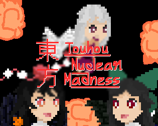
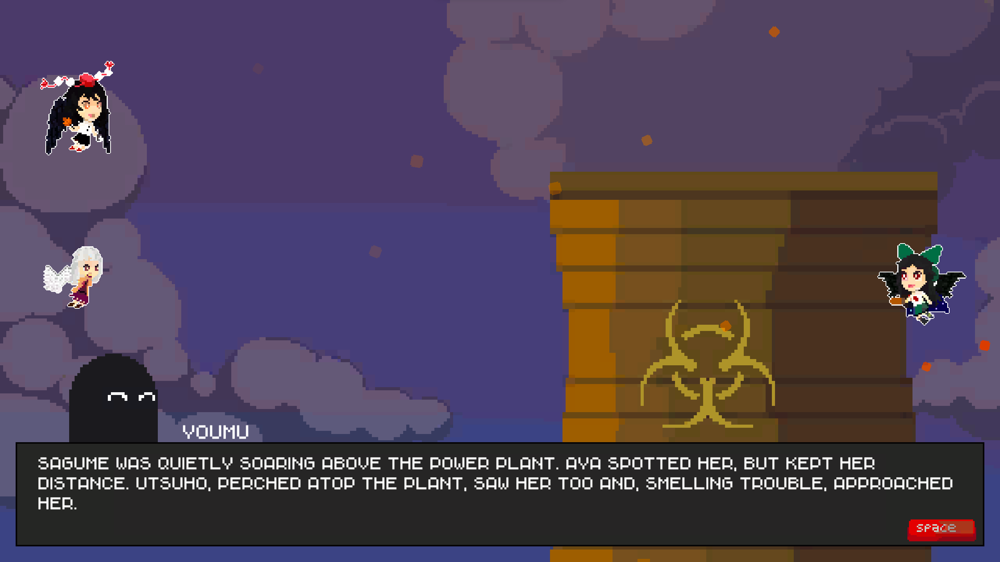

# Touhou - Nuclear Madness
  This game was made as a submission to the <a href='https://itch.io/jam/touhou-jam-12'>Touhou Fan Game Jam - 12</a>.
   
   
  <a href=''>Trailer</a> (Doesn't exist yet)
   
  <a href='https://stashatstake.itch.io/touhou-nuclear-madness'>Link to play</a>
  

  
  

      A side-scrolling, bullet-hell, shooter game. Assume the roles of two characters: the Lunarian goddess, Sagume Kishin, and the sharp-eyed tengu reporter, Aya Shameimaru.
  

  
  
  
  <h1> Gallery </h1>
    
   
  

  
  
  

  
  
  

  
  
  

  

  
  
  <h1> Prerequisites </h1>
  <ul>
      <li>
        <a href='https://unity.com/releases/editor/whats-new/2021.3.10'> Unity Engine ver 2021.3.10f1 </a>
      </li>
  </ul>   
   
  <h1> Co-author </h1>
  

      <a href='https://github.com/RobinTheHoo'> RobinTheHoo </a>
  

